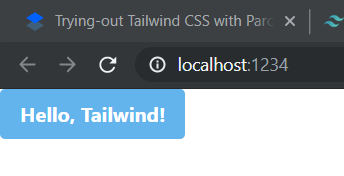
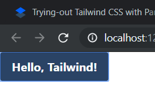
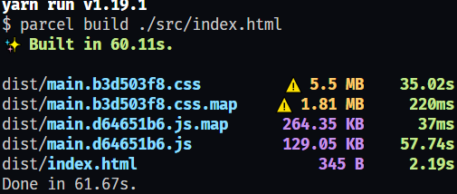
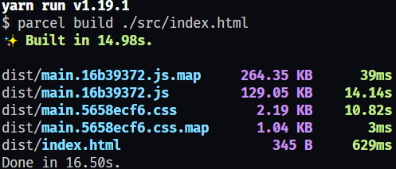
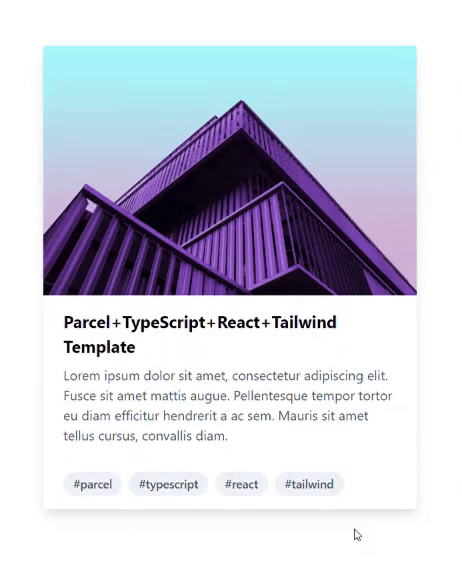

<div class="alert warn">

- This article written targeting TypeScript 3.x, React 16.x, Parcel Bundler 1.x, and Tailwind CSS 1.x is outdated although setting up a project remains mostly the same.

- Scroll to the bottom of the article to find the migration information for TypeScript 4.x, React 17.x, Parcel Bundler 2.x, and Tailwind CSS 2.x.

</div>

A few months ago, I was searching for a UI kit to use in one of my hobby react apps. I found some good-looking React UI kits like [Ant Design](http://ant.design), [BlueprintJS](https://blueprintjs.com) and [Evergreen](https://evergreen.segment.com) but sometimes the bloat becomes unbearable and customizability becomes a priority. [Material UI](https://material-ui.com) is said to be the most popular one, but, no thanks; not a fan of material UI. Anyway, the discussion on available react UI kits is a topic for a different post. Here what happened was that I tried to create my own UI kit with SASS and soon found out that there is a gap between my idea on how the components should look and my knowledge on how to use CSS properly.

## What is Tailwind CSS?

Then I found out Tailwind CSS, which focuses on being a low-level [utility-first](https://tailwindcss.com/docs/utility-first/) (meta) CSS framework.

> Tailwind CSS is a highly customizable, low-level CSS framework that gives you all of the building blocks you need to build bespoke designs without any annoying opinionated styles you have to fight to override.

With Tailwind CSS, you can use class names to apply bite-sized styling to your html elements, almost eliminating the pain of manually writing CSS. The [homepage](https://tailwindcss.com/) has a good demo so visit and see; don't take my word for it.

<div class="alert success">

This blog uses Tailwind CSS ❤

</div>

## Let’s start!

I’m trying out Tailwind CSS together with [Parcel Bundler](https://parceljs.org/), [TypeScript](https://www.typescriptlang.org/) and [React](https://reactjs.org), but the official documentation [lists](https://tailwindcss.com/docs/installation#using-tailwind-cli) other ways to use it. The stack I’ve chosen might as well be harder to get started.

First I’ve created the `tailwind-test` folder and initialized the project with `yarn init -y` (create an empty project with [yarn](https://yarnpkg.com/), skipping all the questions). You can also use `npm init -y`.
First add parcel bundler; this takes care of how to load, process and bundle all the `.tsx`, .`css`, `.html` etc. you’re going to create.

```sh
yarn add --dev parcel-bundler
```

Then add Tailwind CSS as stated in the documentation.

```sh
yarn add tailwindcss
```

Add the below `scripts` section to your `package.json` so that you can run, build and clean the project easily.

```json
"scripts": {
  "start": "parcel ./src/index.html --open",
  "build": "parcel build ./src/index.html",
  "clean": "rm -rf dist .cache"
},
```

Create the `src` folder and create the `index.html` file with a basic HTML5 template. You can also use `html:5` snippet/emmet if you’re using [vscode](https://code.visualstudio.com/).
Add `<div class="app"></div>` and `<script src="./main.tsx"></script>` inside body, so that React can mount your app there.

```html
<!DOCTYPE html>
<html lang="en">
  <head>
    <meta charset="UTF-8" />
    <meta name="viewport" content="width=device-width, initial-scale=1.0" />
    <meta http-equiv="X-UA-Compatible" content="ie=edge" />
    <title>Document</title>
  </head>
  <body>
    <div id="app"></div>
    <script src="./main.tsx"></script>
  </body>
</html>
```

Create the `main.tsx` and add your React app there. Note that we have added a [button](https://tailwindcss.com/components/buttons) which uses Tailwind styles with utility classes. Utility classes is [not the only way](https://tailwindcss.com/docs/extracting-components) you can add Tailwind styles. Since we’re trying Tailwind with React, utility classes is enough for us right now.

```tsx
import * as React from "react";
import { render } from "react-dom";

function App() {
  return (
    <div>
      <button className="bg-blue-500 hover:bg-blue-700 text-white font-bold py-2 px-4 rounded">
        Hello, Tailwind!
      </button>
    </div>
  );
}

render(<App />, document.getElementById("app"));
```

Create `main.css` file and add the below. These are tailwind directives. This is needed to inject tailwind [styles](https://tailwindcss.com/docs/preflight) and utility classes into your CSS.

```css
@tailwind base;

@tailwind components;

@tailwind utilities;
```

Add `postcss.config.js` file inside the project folder (i.e.: one level up from `src` folder). Tailwind CSS is a [PostCSS](https://postcss.org/) plugin where PostCSS handles all pre/post processing of CSS you write, such as adding [vendor prefixes](https://developer.mozilla.org/en-US/docs/Glossary/Vendor_Prefix) [automatically](https://github.com/postcss/autoprefixer). Parcel has built-in support for PostCSS, but doesn’t know yet about Tailwind, so we have to configure it with the below content. Make sure you include `tailwindcss` before `autoprefixer`.

```js
module.exports = {
  plugins: [
    require("tailwindcss"),
    require("autoprefixer"),
    require("postcss-nested"),
  ],
};
```

Now it’s show-time. Run `yarn start`.
At this moment, if you are curious why we didn’t add typescript or react, don’t worry; parcel will install them automatically — and yes, it knows that TypeScript is a dev dependency. And since you have passed the `--open` flag, it even opens the browser window for you.

You should see something like below.


Done.

## Trying to style my way

I tried playing with it a little. Changed `hover:bg-blue-700` to `hover:bg-blue-400`. Now it displays a lighter color on mouse over.

```tsx
<button className="bg-blue-500 hover:bg-blue-400 text-white font-bold py-2 px-4 rounded">
  Hello, Tailwind!
</button>
```



Added an [active](https://tailwindcss.com/docs/pseudo-class-variants#active) background color using `active:bg-blue-900`. (This technique with colon is called Pseudo-class Variants in Tailwind CSS; we use pseudo-class names in `className` rather than in CSS.) Nothing changed. It still shows the hover color on press! What could have gone wrong? It is actually documented right below where the example for `active:` is. We have to add `active` variant to the Tailwind config file `tailwind.config.js`.

```js
module.exports = {
  // ...
  variants: {
    backgroundColor: ["active", "responsive", "hover", "focus"],
  },
  // ...
};
```

By default, [some of the variants are disabled](https://tailwindcss.com/docs/pseudo-class-variants#default-variants-reference) due to file-size considerations. Even with these disabled, Tailwind is quite [large](https://tailwindcss.com/docs/controlling-file-size). 😕
Anyway, now I configured variants as the above and ran `yarn clean` to clean temp files and started again. We clearly configured tailwind! Or… did we? There is an order how we should organize variants, because, [Tailwind is no magic](https://tailwindcss.com/docs/configuring-variants/#ordering-variants); it generates CSS. CSS precedence applies here too.
I enabled all the variants in the correct order for all the styles with the below. We don’t have file size considerations for this test so that is fine.

```js
module.exports = {
  variants: [
    "responsive",
    "group-hover",
    "focus-within",
    "first",
    "last",
    "odd",
    "even",
    "hover",
    "focus",
    "active",
    "visited",
    "disabled",
  ],
};
```

It works.



## Next steps…

Let’s see the file sizes…



Gosh! It’s huge. This is not the size you want your production CSS bundle to be. We are using a lot of unwanted styles. But how do we reduce the bundle? [Manually selecting](https://tailwindcss.com/docs/controlling-file-size#removing-unused-theme-values) what is necessary using the configuration file is hard. We have to try [something else](https://tailwindcss.com/docs/controlling-file-size#setting-up-purgecss).

> Mozilla's [Firefox Send](https://send.firefox.com/) is built with Tailwind, yet somehow their CSS is only 13.1kb minified, and only 4.7kb gzipped! How?
> They're using [Purgecss](https://www.purgecss.com/),…

~~Let’s add `purgecss`. Run `yarn add @fullhuman/postcss-purgecss -D`. Unfortunately, parcel currently fails to auto install postcss plugins just by looking at its config. I don’t think it’s in parcel’s scope.~~

**Update: As of `tailwindcss` version `1.4.5`, we don't need to configure purgecss this way. So do not install `purgecss` and keep your `postcss.config.js` intact. (The old way would also work, anyway.)**

```js
// const purgecss = require("@fullhuman/postcss-purgecss")({
//   // Specify the paths to all of the template files in your project
//   content: [
//     "./src/**/*.html",
//     "./src/**/*.{t,j}sx"
//     // etc.
//   ],
//   // Include any special characters you're using in this regular expression
//   defaultExtractor: content => content.match(/[\w-/:]+(?<!:)/g) || []
// });
module.exports = {
  plugins: [
    require("tailwindcss"),
    require("autoprefixer"),
    require("postcss-nested"),
    // ...(process.env.NODE_ENV === "production" ? [purgecss] : [])
  ],
};
```

**Update: But edit the `tailwind.config.css` to look like the below (note the _purge_):**

```js
module.exports = {
  purge: ["./src/**/*.html", "./src/**/*.{j,t}sx"],
  theme: {
    // ...
  },
  variants: [
    //...
  ],
};
```

Now, let’s check the file sizes…



It’s down to ~~two~~ (**update: a little larger than that**) kilobytes. That’s because we only have a few classes used.
So what exactly does purgecss do? It basically traverses through all our `.tsx` files and finds the class names we have used. Then it removes selectors that match all unused class names from CSS (check that regex!). Ugly, but works. Of course, you have to be careful when dynamically generating CSS class names in react.
At this moment, you should’ve realized that although Tailwind can make our lives easier, it also has its own drawbacks. Working with Tailwind CSS is NOT a no-brainer.

## The good, the bad, and the ugly

I can notice several good things about Tailwind CSS at a glance.

- Get things done without having to write a lot of code.
- No need to worry about different CSS naming standards and conventions such as [BEM](http://getbem.com/naming/) or [OOCSS](http://oocss.org/).
- The built-in styles are pretty good and useful.
- Tailwind doesn’t hate customization. New plugins can be created and configuration is very flexible.
- Can write your own CSS also, if you want an escape route (No lock-in).

There isn’t much to complain about the library but,

- It can get unintuitive sometimes to configure.
- Gradients, icons, animations ~~and transitions~~ (**update: transitions and transforms are there after v1.2.0**) aren’t built-in. Adding them can be complicated.
- Advanced controls such as switches, calendars, tables, floating notifications, modals etc. are not available.
- Generated CSS can get quite large if you’re using a lot of features. Using purgecss eliminates this but it’s kind of ugly because it does a string search; not proper parsing. But, again, it doesn’t know what template language/framework we’re using.
- Lack of IDE support (yet). But there are vscode extensions, ~~but none for react~~ (**Update: bradlc.vscode-tailwindcss worked for react**).

## Demo

~~The demo below uses Tailwind plugins `tailwindcss-transforms` and `tailwindcss-transitions` because tailwind doesn’t support transforms and transitions out-of-the-box.~~



I created a template with the above plugins as a starting point [here](https://github.com/umstek/parcel-typescript-react-tailwind) on GitHub.

Or, [see it in action](https://parcel-typescript-react-tailwind.vercel.app/).

<div class="alert success">

The boilerplate on github and the demo are up-to-date.

</div>

Tailwind also supports custom themes, variants, plugins etc., but that’s outside the scope of this short post. The documentation is your friend.

## Updates

#### 2020 October Update 1

Get ready for v2.0 upgrade, remove warning messages.

`tailwind.config.js`.

```js
  future: {
    removeDeprecatedGapUtilities: true,
    purgeLayersByDefault: true,
  },
```

#### 2021 May Update 1

Upgraded parcel bundler to 2.x; this requires the image URLs to be changed.

```diff
- import cardImage from "../../static/vitalik-vynarchyk-0PePaKnEmuM-unsplash.jpg";
+ import cardImage from "url:../../static/vitalik-vynarchyk-0PePaKnEmuM-unsplash.jpg";
```

We need to ignore `.parcel-cache` from committing. (.gitignore). Changed the `clean` command too.

```diff
+ .parcel-cache
```

TypeScript Alias paths are not working; but maybe we can fix it? However, specify relative URL for now.

```diff
- import "~styles/main.pcss";
+ import "../styles/main.pcss";
```

TypeScript has been upgraded to 4.x together with the parcel upgrade. I changed the `tsconfig.json`.

```diff
- "target": "es5",
- "module": "esnext",
+ "moduleResolution": "node",
+ "target": "ESNext",
+ "module": "ESNext",
```

After the 2.x upgrade, `tailwind.config.js` is totally new. We also now use the experimental JIT mode.

And we use a `.postcssrc` file instead of `postcss.config.js` to avoid breaking hot reload.

## Resources

https://www.tailwindtoolbox.com/

https://tailwindcomponents.com/

https://tailwindtemplates.io/cards/

https://github.com/aniftyco/awesome-tailwindcss
