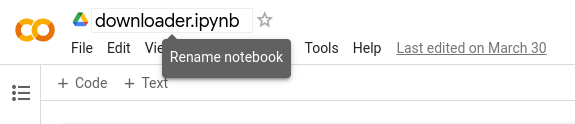

Let's say you are browsing the internet and found something valuable to download. But there are one or more issues:

- It's huge, you probably want to use night time data if you live in a 3rd world country like me.
- The connection between the server that hosts the file and your computer is slow. But you get a feeling that it would probably be faster between the file host and Google servers, and also Google Drive and you.
- You believe the download (link) will not be available for long, but you can't download it right now, for some reason. Say you're on your mobile phone.

How cool would it be if you had some storage in the cloud so you can keep it there and download to your computer whenever you need it?

You can use an external service like [MultCloud](https://www.multcloud.com/tutorials/download-torrents-directly-to-google-drive.html). Or, you can use a VPS, or just an AWS EC2 instance and download them to EBS or an S3 bucket, with some knowledge, of course. This won't likely cost a lot either. But there is a way to do this for free, and easily. But, this needs some programming knowledge too.

1. Go to https://colab.research.google.com/
2. [Optional] If you are asked to sign-up or sign in, do that with your Google account.
3. Create a new notebook.
4. You can name it anything you like; I have named it "downloader".
   

So, what have you just created? This is called an [interactive python notebook](https://ipython.org/notebook.html) or a [Jupyter](https://jupyter.org/) notebook. These allow you to run python code block by block, and see the output of each block directly below it. With extensions/libraries, these support creating graphs, tables, images etc. everything within the notebook itself. [Colab](https://colab.google/) is a hosted Jupyter Notebook service that requires no setup to use and provides free access to computing resources, including GPUs and TPUs. These are popular among academics, scientific computing, and ML/AI communities. But that doesn't mean you cannot use it.

Now, let's write the code needed.

1. First, you have to mount the Google drive. You can follow the [official instructions](https://colab.research.google.com/notebooks/io.ipynb#scrollTo=u22w3BFiOveA). Basically, you'll have to paste
   ```py
   from google.colab import drive
   drive.mount('/content/drive')
   ```
   into the first cell, and click the play button or press Ctrl+Enter. Then a link should appear and you'll have to click on that, and give permissions when asked.
2. Now, copy the link to the file that you want to download from the remote location and assign it to `url` variable in the next cell. Make sure to run each cell as you enter these into them.
   ```py
   url = "https://example.com/file.zip"
   ```
3. We need to clean the URL a bit to convert it to a file path.

   ```py
   import urllib.parse
   import os

   download_dir = '/content/gdrive/MyDrive/downloads'
   filename = urllib.parse.unquote(os.path.basename(link))
   file_path = os.path.join(download_dir, filename)
   ```

4. Let's download the file into Google Drive now. This might take some time.

   ```py
   import requests

   response = requests.get(link)
   with open(file_path, 'wb') as f:
      f.write(response.content)
   ```

5. Visit your downloads folder. `downloads` here. You'll see the downloaded file in the drive. Now you can download it to your computer later.

You are not limited to downloading a single file at a time. The below is a script I used to scrape an archive.org page and then download all the video files into Google drive.

https://gist.github.com/umstek/89b822fd864b330c32cea2f8e16214d5

<script src="https://gist.github.com/umstek/89b822fd864b330c32cea2f8e16214d5.js"></script>

You can probably download [torrents](https://github.com/FKLC/Torrent-To-Google-Drive-Downloader/blob/master/Torrent_To_Google_Drive_Downloader.ipynb) too. The possibilities are endless. It's your responsibility to be wary of the content you download, and make sure you don't abuse the service.
