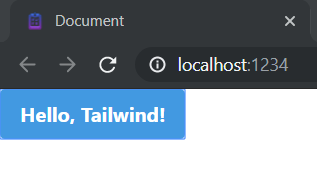
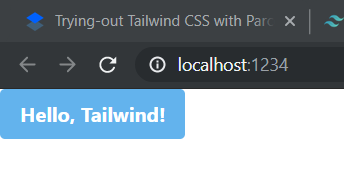
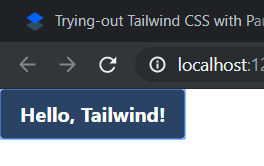
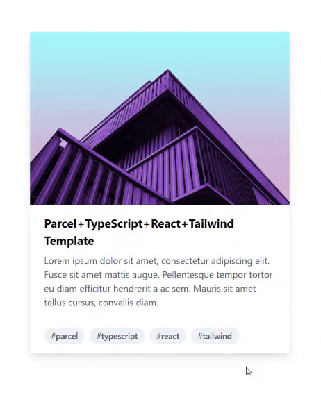

<div class="alert success">

Heads up!

This article has been updated to use the latest parcel, typescript, react, and tailwind. See the updated date
to know when it was last updated.

</div>

A few ~months~ years ago, I was searching for a UI kit to use in one of my hobby react apps. I found some good-looking
React UI kits like [Ant Design](http://ant.design), [BlueprintJS](https://blueprintjs.com) and
[Evergreen](https://evergreen.segment.com) but sometimes the bloat becomes unbearable and customizability becomes a
priority. [Material UI](https://material-ui.com) is said to be the most popular one, but, no thanks; not a fan of
material UI unless google implements it (update: MUI5 looks good). Anyway, the discussion on available react UI kits is
a topic for a different post. Here what happened was that I tried to create my own UI kit with SASS and soon found out
that there is a gap between my idea on how the components should look and my knowledge on how to use CSS properly. So I
tried to find a shortcut that would allo me to create professional-grade UIs with not much UI design knowledge.

## What is Tailwind CSS?

Then I found out Tailwind CSS, which focuses on being a low-level
[utility-first](https://tailwindcss.com/docs/utility-first/) (meta) CSS framework.

> Tailwind CSS is a highly customizable, low-level CSS framework that gives you all of the building
> blocks you need to build bespoke designs without any annoying opinionated styles you have to fight
> to override.

With Tailwind CSS, you can use class names to apply bite-sized styling to your html elements, almost
eliminating the pain of manually writing CSS. The [homepage](https://tailwindcss.com/) has a good
demo so visit and see; don't take my word for it.

<div class="alert info">

This blog uses Tailwind CSS ❤

</div>

## Let's start

I'm trying out Tailwind CSS together with [Parcel Bundler](https://parceljs.org/),
[TypeScript](https://www.typescriptlang.org/) and [React](https://reactjs.org), but the official
documentation [lists](https://tailwindcss.com/docs/installation/framework-guides) other ways to
use it. The stack I've chosen might as well be harder to get started.

First I've created the `tailwind-test` folder and initialized the project with `yarn init -y`
(create an empty project with [yarn](https://classic.yarnpkg.com/), skipping all the questions). You
can also use `npm init -y` or even `pnpm`. First add parcel bundler; this takes care of how to load,
process and bundle all the `.tsx`, .`css`, `.html` etc. you're going to create.

```sh
yarn add --dev parcel
```

Then add Tailwind CSS as stated in the documentation.

```sh
yarn add tailwindcss
```

Add the below `scripts` section to your `package.json` so that you can run, build and clean the project easily.

```json
"scripts": {
  "start": "parcel ./src/index.html --open",
  "build": "parcel build ./src/index.html",
  "clean": "rm -rf dist .cache"
},
```

Create the `src` folder and create the `index.html` file with a basic HTML5 template. You can also use `html:5`
snippet/emmet if you're using [vscode](https://code.visualstudio.com/).
Add `<div class="app"></div>` and `<script src="./main.tsx"></script>` inside body, so that React can mount your app
there.

```html
<!doctype html>
<html lang="en">
  <head>
    <meta charset="UTF-8" />
    <meta name="viewport" content="width=device-width, initial-scale=1.0" />
    <meta http-equiv="X-UA-Compatible" content="ie=edge" />
    <title>Document</title>
  </head>
  <body>
    <!-- [!code highlight:2] -->
    <div id="app"></div>
    <script src="./main.tsx"></script>
  </body>
</html>
```

Create the `main.tsx` and add your React app there. Note that we have added a button which uses Tailwind styles with
utility classes. Utility classes are [not the only way](https://tailwindcss.com/docs/reusing-styles) you can add
Tailwind styles. Since we're trying Tailwind with React, utility classes is enough for us right now.

```tsx
import React from "react";
import ReactDOM from "react-dom/client";

function App() {
  return (
    <div>
      <button className="rounded bg-blue-500 px-4 py-2 font-bold text-white hover:bg-blue-700">
        Hello, Tailwind!
      </button>
    </div>
  );
}

ReactDOM.createRoot(document.getElementById("app")!).render(<App />);
```

Create `main.css` file and add the below. These are tailwind directives. This is needed to inject tailwind
[styles](https://tailwindcss.com/docs/preflight) and utility classes into your CSS.

```css
@tailwind base;

@tailwind components;

@tailwind utilities;
```

Add `.postcssrc` file inside the project folder (i.e.: one level up from `src` folder). Tailwind CSS is a
[PostCSS](https://postcss.org/) plugin where PostCSS handles all pre/post processing of CSS you write, such as adding
[vendor prefixes](https://developer.mozilla.org/en-US/docs/Glossary/Vendor_Prefix)
[automatically](https://github.com/postcss/autoprefixer). Parcel has built-in support for PostCSS, but doesn't know yet
about Tailwind, so we have to configure it with the below content. Parcel does the work of `autoprefixer` automatically
so you don't need to add it.

```json
{
  "plugins": {
    "postcss-import": {},
    "tailwindcss/nesting": {},
    "tailwindcss": {}
  }
}
```

Now it's show-time. Run `yarn start`.
At this moment, if you are curious why we didn't add typescript or react, don't worry; parcel will install them
automatically — and yes, it knows that TypeScript is a dev dependency. And since you have passed the `--open` flag, it
even opens the browser window for you.

You should see something like below.



Done.

## Trying to style my way

I tried playing with it a little. Changed `hover:bg-blue-700` to `hover:bg-blue-400`. Now it displays a lighter color on
mouse over.

```tsx
<button className="rounded bg-blue-500 px-4 py-2 font-bold text-white hover:bg-blue-400">
  Hello, Tailwind!
</button>
```



Added an [active](https://tailwindcss.com/docs/pseudo-class-variants#active) background color using
`active:bg-blue-900`. (This technique with colon is called Pseudo-class Variants in Tailwind CSS; we use pseudo-class
names in `className` rather than in CSS.)

<div class="alert warn">
  Faded content is for an older version and not applicable anymore.
</div>

It works.



## Next steps…

Now, let's check the file sizes… It's only a few kilobytes!

Tailwind basically traverses through all our `.tsx` files and finds the class names we have used. Then it removes
selectors that match all unused class names from CSS (check that regex!). Ugly, but works. Of course, you have to be
careful when dynamically generating CSS class names in react.

At this moment, you should've realized that although Tailwind can make our lives easier, it also has its own drawbacks.
Working with Tailwind CSS is NOT a no-brainer.

## The good, the bad, and the ugly

I can notice several good things about Tailwind CSS at a glance.

- Get things done without having to write a lot of code.
- No need to worry about different CSS naming standards and conventions such as [BEM](http://getbem.com/naming/) or
  [OOCSS](http://oocss.org/).
- The built-in styles are pretty good and useful.
- Tailwind doesn't hate customization. New plugins can be created and configuration is very flexible.
- Can write your own CSS also, if you want an escape route (No lock-in).

There isn't much to complain about the library but,

- Advanced controls such as switches, calendars, tables, floating notifications, modals etc. are not available.

## Demo



I created a template with the above plugins as a starting point
[here](https://github.com/umstek/parcel-typescript-react-tailwind) on GitHub.

Or, [see it in action](https://parcel-typescript-react-tailwind.vercel.app/).

<div class="alert success">

The boilerplate on github and the demo are up-to-date.

</div>

Tailwind also supports custom themes, variants, plugins etc., but that's outside the scope of this short post. The
documentation is your friend.

## Resources

Official: [https://tailwindcss.com/resources](https://tailwindcss.com/resources)

Official (paid): [https://tailwindui.com/](https://tailwindui.com/)

Official: [https://headlessui.com/](https://headlessui.com/)

[https://github.com/aniftyco/awesome-tailwindcss](https://github.com/aniftyco/awesome-tailwindcss)

[https://tailblocks.cc/](https://tailblocks.cc/)

[https://daisyui.com/](https://daisyui.com/)

Doesn't use tailwind, but complementary: [https://www.radix-ui.com/](https://www.radix-ui.com/)

<div class="alert error">
  I'm not affiliated with any project mentioned above.
</div>

<div class="alert info">
  Leave a comment below if you have followed the above guide with success, or
  faced any issues.
</div>
